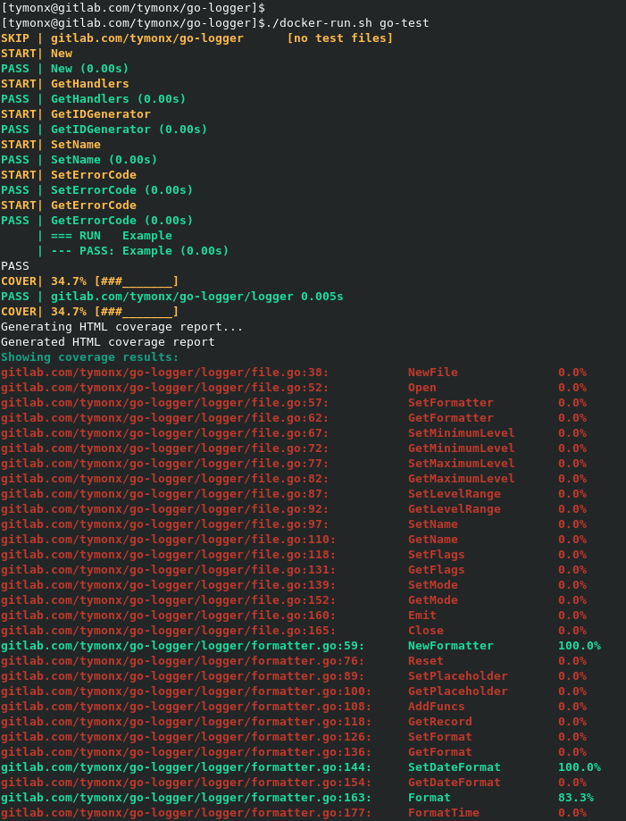

# Docker Go

A Docker image with preinstalled tools for developing, mocking, formatting, linting,
building, testing and documenting Go projects.

## Features

*   Pre-installed required tools for developing, mocking, formatting, linting, building, testing and documenting Go projects
*   Pre-installed the `mockgen` tool for generating mocks for testing
*   Formatting and validating Go source files imports with the `goimports` tool
*   Formatting and validating Go source files format with the `gofmt` tool
*   Validating Go source files errors with the `errcheck` tool
*   Linting Go source files with the `revive`, the `golangci-lint` and the `golint` tools
*   Building Go source files
*   Testing Go project
*   Generating Go coverage result, text and HTML reports
*   Generating JUnit test XML report for GitLab Merge Requests
*   Generating Cobertura coverage XML report for GitLab Merge Requests
*   Validating Go coverage value threshold with colorization
*   Colorizing Go imports and format validation with the `colordiff` tool
*   Colorizing Go tests with the `richgo` tool
*   Colorizing Go coverage results and format nicely with the `column` tool
*   Generating static HTML coverage report with the `go tool cover` tool

## Example



## Usage

Download the `docker-run.sh` helper script:

```plaintext
wget -O docker-run.sh https://gitlab.com/tymonx/docker-go/-/raw/master/docker-run.sh
```

Make it executable:

```plaintext
chmod a+x ./docker-run.sh
```

Run the `docker-run.sh` script without any arguments to work in Docker container:

```plaintext
./docker-run.sh
```

Or pass arguments to the `docker-run.sh` script to execute commands inside Docker container:

```plaintext
./docker-run.sh go build ./...
```

Use the `go-mock` command to create mocks for all automatically detected Go interfaces:

```plaintext
./docker-run.sh go-mock
```

Use the `go-format` command to automatically reformat Go source files:

```plaintext
./docker-run.sh go-format
```

Use the `go-lint` command to run various Go linters on Go source files with enabled colorization:

```plaintext
./docker-run.sh go-lint
```

Use the `go-build` command to build Go source files. Equivalent to the `go build ./...` execution:

```plaintext
./docker-run.sh go-build
```

Use the `go-test` command to run tests and validate coverage result with enabled colorization:

```plaintext
./docker-run.sh go-test
```

Use the `go-doc` command to run Go source code documentation server for your project on default `localhost:6060`:

```plaintext
./docker-run.sh go-doc
```

All commands accept standard Go paths as additional arguments like `./`, `./...`, `./<path>` and so on.
